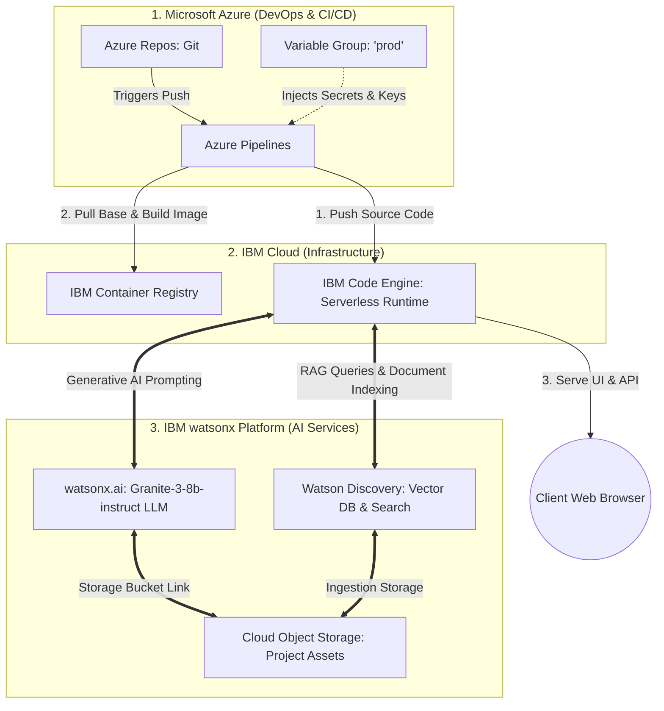
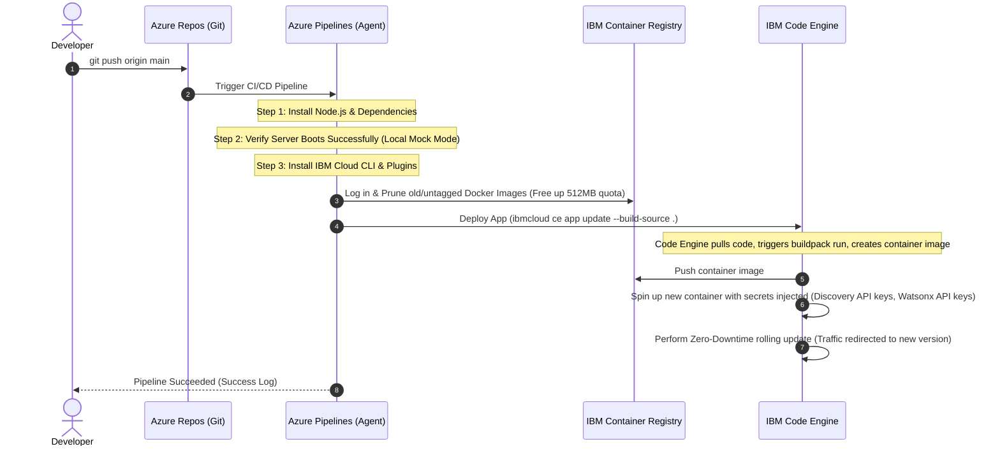
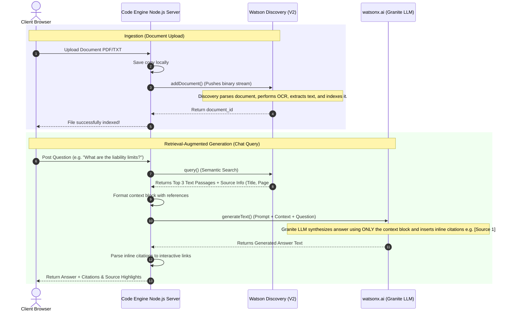

# Enterprise Architecture Design: CognitiveDoc AI
**Integration between Microsoft Azure and IBM Cloud**

This document describes the high-level architecture design for CognitiveDoc AI, illustrating how code flows from Azure DevOps into IBM Cloud during development, and how data flows between your deployed application and IBM's AI services at runtime.

---

## 1. High-Level Architecture Overview

CognitiveDoc AI utilizes a **Hybrid Multi-Cloud Architecture**:
* **Azure DevOps (Microsoft)** is used for project management, source control, and the automated CI/CD pipeline (DevOps Layer).
* **IBM Cloud** hosts the serverless runtime and the core AI services (Runtime & AI Layer).

---

## 2. CI/CD Lifecycle (Azure to IBM Cloud)

This workflow shows how code changes are validated, packaged, and deployed serverlessly without manual intervention.

---

## 3. RAG Runtime Data Flow (The AI Integration)

When a user interacts with the application, this diagram illustrates how Watson Discovery and watsonx.ai work together to formulate cited answers.

---

## 4. Resource Directory & Functionalities

Here is a directory of the cloud resources used and their role in the platform.

### Azure Resources (Microsoft)
| Resource / Service | Functionality |
| :--- | :--- |
| **Azure Repos** | Hosts the Git codebase, maintaining version history for frontend code (`public/`) and Node.js backend controller (`server.js`). |
| **Azure Pipelines** | Runs the automated build runner. Executes testing suites (checking if the backend boots locally) and triggers the IBM Cloud CLI build process. |
| **Azure Pipeline Library (Variable Group: `prod`)** | Securely vaults sensitive API keys and IDs (`WATSONX_AI_APIKEY`, `WATSON_DISCOVERY_APIKEY`) and injects them as environment variables during build time. |

### IBM Cloud & watsonx Resources (IBM)
| Resource / Service | Functionality |
| :--- | :--- |
| **IBM Code Engine** | Serverless application hosting environment. It automatically scales containers to zero when idle (saving costs) and scales up instantly when a user visits the app. Handles container image building from raw source code. |
| **IBM Container Registry (ICR)** | Private repository hosting the compiled Docker container images built by Code Engine. |
| **Watson Discovery (Plus Trial)** | Document parsing and semantic vector search engine. Ingests uploaded PDFs, splits them into semantic paragraphs, and returns matches to query inputs. |
| **watsonx.ai (Lite)** | Advanced Generative AI portal. Hosts the `ibm/granite-3-8b-instruct` large language model used to read the matched paragraphs and compile natural answers. |
| **Cloud Object Storage (COS) (Lite)** | Object storage bucket that acts as the physical hard drive for watsonx and Watson Discovery. |
